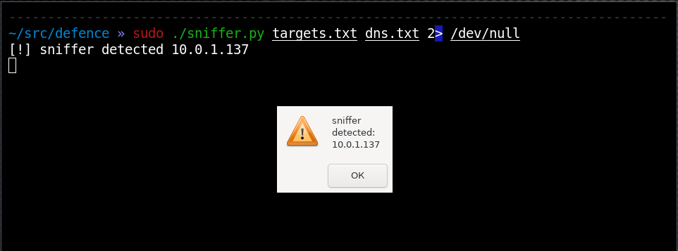
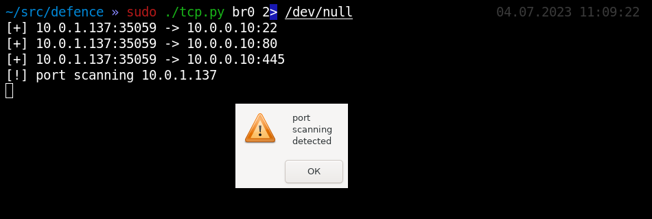

# Hackings style defence tricks
Simple technical techniques that allow you to detect intruders at different stages.
All the techniques presented do not require exclusive rights and can be performed by an ordinary employee - everyone can protect their company.

## Network level \[internal intruder\]
The attacker has just penetrated your corporate network. He doesn't have an account yet and knows almost nothing about your network. His actions will be largely random. It is very important to catch the attacker at this early stage.

### sniffer.py
A running sniffer is not yet a network attack, but its detection is an important prerequisite for possible future attacks. A decent user will not run the sniffer.
A carelessly launched sniffer will make DNS requests that are predictable for us, since the sniffer can show a domain name instead of an IP address. If we periodically send a packet on behalf of an IP address that has a PTR DNS record, and then check the presence of this record in the cache of the corporate DNS server (non-recursive request, aka DNS cache snooping), then we will most likely detect an attacker.

### tcp.py
The second thing that an internal attacker will most likely use at the very beginning is, of course, port scanning. While he does not have an account and does not understand the structure of the network, he will blindly search for his targets by scanning ports. And sooner or later its packets will reach your computer.
It is quite easy to notice such activity. Of all the traffic, only TCP-SYN packets need to be isolated, which is an excellent marker for this network attack. The `tcp.py` script reacts only to incoming connections; if the number of unique ports is exceeded, an alert occurs.
As a result, even if the attacker scanned only a couple of ports, we will see it.

## Active Directory level \[internal intruder\]

Coming soon

## Wi-Fi level \[external intruder\]

Coming soon
